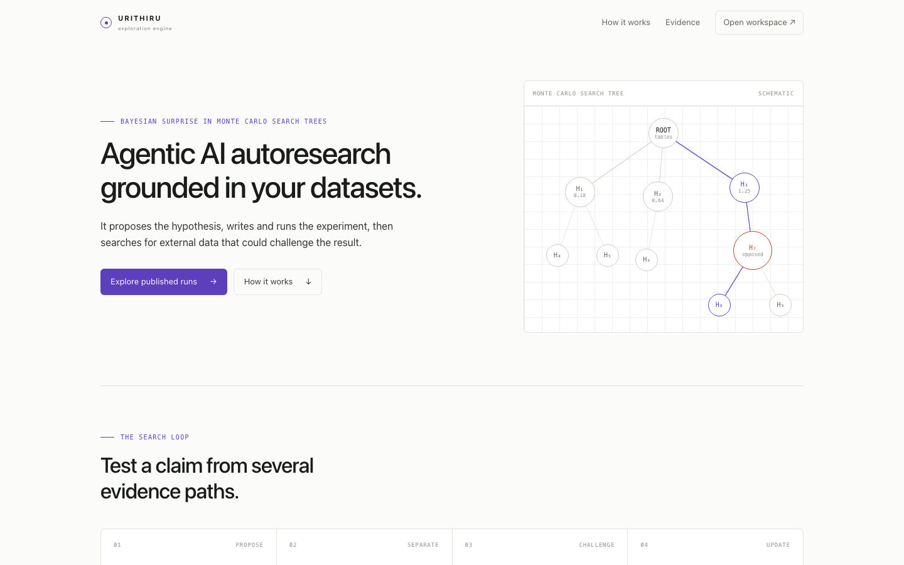

# Urithiru

Autonomous scientific exploration over your own tabular data. You supply a dataset in CSV form or similar and optional metadata notes. Agents perform exploratory analysis, propose falsifiable hypotheses, form a literature-only prior, test each hypothesis with code they write and execute, optionally seek a candidate external dataset, and return a ranked, inspectable report.



Urithiru is a research prototype. Its agents write the analyses and report their own
metrics, validity flags and source provenance. The host validates structure and retains
the code, logs and inputs for review; it does not independently certify the statistical
analysis or prove that an external dataset is independent. Treat every result as a lead
for expert review, not as scientific ground truth.

## How it works

A run is a Monte Carlo tree search over hypotheses. Each **step** can use four agent
stages on one claim:

1. **Proposal** — an agent explores your files and proposes candidate claims.
   Duplicates are removed and the most novel candidate is selected.
2. **Search** and **Code** — the search workspace is prepared without your data; the code goal is
   prepared without the literature conclusion.
3. **External** — when those two answers disagree enough to be surprising, a fourth
   agent attempts to find a compatible dataset collected elsewhere and tests the claim again.

The result updates the tree, and the next step explores from there. `--steps` is how
many hypotheses you want evaluated.

The distance between the search and code beliefs is the whole point, so the two goals are
prepared without each other's evidence.

Full detail: [docs/architecture.md](docs/architecture.md), [docs/google.md](docs/google.md), [docs/local.md](docs/local.md).

## Step-by-Step Setup

### Prerequisites

- **Python 3.12+** and [**uv**](https://docs.astral.sh/uv/)
- [**Bun**](https://bun.sh/) (for the web application)
- **Docker** (for local runs) or **Google Cloud SDK (`gcloud`)** (for Cloud Run Jobs)

### 1. Installation

```sh
# Clone repository
git clone https://github.com/eamag/urithiru.git
cd urithiru

# Install Python package and development tools
uv sync

# Install Web dashboard dependencies
cd web && bun install && cd ..

# Verify CLI
uv run urithiru --help
```

### 2. Get a dataset

Bring your own files. The agent can read CSV, TSV, Parquet, XLSX and XLS files.
Metadata is optional UTF-8 text that explains columns, units, study design and known
limitations.

### 3. Run Locally (Docker)

Build the included worker image, create a persistent login volume, and authenticate the
agent CLI once. The same image runs the Cloud orchestrator as an unprivileged user and
local agent stages as root so they can read the mounted login volume.

```sh
docker build -t urithiru-sandbox:latest .
docker volume create agy_credentials
docker run --rm -it --user root \
  -v agy_credentials:/root \
  --entrypoint /usr/local/bin/agy \
  urithiru-sandbox:latest

# Host-side prior, embedding and deduplication calls
export VERTEX_API_KEY=your-vertex-api-key

# Launch discovery over your files
uv run urithiru run \
  --data /absolute/path/data.csv \
  --metadata /absolute/path/context.md \
  --steps 3 \
  --seed 42
```

Follow the run live:

```sh
uv run urithiru logs ./runs/<run-id> --follow
uv run urithiru status ./runs/<run-id>
```

### 4. Run on Google Cloud (Cloud Run Jobs & Cloud Storage)

The cloud runtime uses **Google Cloud Run Jobs** for serverless orchestrator execution, **Cloud Storage** for atomic state checkpoints, and the **Antigravity CLI** + **Google GenAI SDK** for agent reasoning.

1. Copy the profile and fill in your own identifiers. `configs/google.toml` ships with
   placeholders and is refused until they are replaced; `*.local.toml` is gitignored, so
   your project and bucket never reach a commit. See [docs/google.md](docs/google.md) for
   the bucket, service account and job setup.

   ```sh
   cp configs/google.toml configs/google.local.toml
   $EDITOR configs/google.local.toml   # set project, region, bucket, orchestrator_job
   ```

2. Start a background discovery job:

```sh
uv run urithiru run \
  --config configs/google.local.toml \
  --data /absolute/path/data.csv \
  --metadata /absolute/path/context.md \
  --steps 5 \
  --seed 42
```

3. Manage your cloud discovery:

```sh
uv run urithiru status gs://your-bucket/urithiru/<run-id>
uv run urithiru logs gs://your-bucket/urithiru/<run-id> --follow
uv run urithiru resume gs://your-bucket/urithiru/<run-id> --steps 8
uv run urithiru export gs://your-bucket/urithiru/<run-id> --output ./export
```

### 5. Interactive Web Dashboard

`web/` is a static Astro and Svelte application. It renders published MCTS trees,
four-stage belief progressions, generated statistical charts and retained event logs.
There is no server API and the browser cannot launch, resume or cancel runs.

```sh
# Copy a reviewed run into the static site
uv run urithiru publish gs://your-bucket/urithiru/<run-id>

# Enter the web project once
cd web

# Start the development server
bun run dev

# Or build and preview the static production output
bun run build && bun run preview
```

Open `http://localhost:4321` in your browser. A new clone has no published runs and
shows an empty state until `urithiru publish` writes `web/public/runs/`.

## Steps and time

`--steps` sets how many hypotheses to evaluate. The `[budget]` section of the profile
sets how long each stage may take, in minutes:

```toml
[budget]
proposal_minutes = 5
search_minutes = 8      # these two run at the same time,
code_minutes = 10       # so a step costs the larger of them, not the sum
external_minutes = 10
grace_minutes = 4
```

Override any of them for one run without editing the profile:

```sh
uv run urithiru run --data ./data.csv --steps 5 --external-minutes 25
```

A step costs at most `proposal + max(search, code) + external` minutes, and steps run
`parallelism` at a time (2 by default), so 5 steps with the values above is roughly
35-65 minutes of wall clock. Not every step reaches the external stage: it runs only
when the two beliefs disagreed enough. Because search and code run together, a step
holds up to two stage workers at once, and a run holds up to `2 x parallelism`.

## Output

A run directory (local or in the bucket) holds:

```text
run_config.json         resolved settings, input hashes and metadata
mcts_state.json         authoritative tree, RNG, pending/completed IDs and status
events.jsonl            every event in order; read this to follow a run in progress
candidate_audits.json   raw proposals, duplicate decisions and selection evidence
inputs/                 your original files, unmodified
artifacts/              cached embeddings and pairwise LLM deduplication decisions
evaluations/            one immutable JSON per completed hypothesis
sandbox_artifacts/      each agent's code, execution logs and retained sources
```

`urithiru export` copies all of that to a new directory and adds `report.json` and
`report.md`, ranked by reward. Treat the evidence directory as private until you
have reviewed it.

## Commands

```text
urithiru run        --data FILE...        start a run
urithiru status     RUN                   progress, last update, and whether it is alive
urithiru logs       RUN [--follow]        the run's event log, in order
urithiru resume     RUN                   continue from the checkpoint
urithiru cancel     RUN                   stop, preserving completed work
urithiru publish    RUN [--watch]         copy the run where the web page can read it
urithiru unpublish  RUN                   remove a run's published web copy
urithiru catalog    [--config FILE]       list runs directly from the Cloud Storage bucket
urithiru artifact   --run ID --name FILE  print a sanitized artifact from the bucket
urithiru label      --run ID --title STR  name or label a cloud run
urithiru export     RUN --output DIR      copy the run and write the ranked report
```

`RUN` is a local run directory or the `gs://bucket/prefix/run-id` printed at start;
every command works on both. The entry point is `app()` in
[src/urithiru/cli.py](src/urithiru/cli.py), where each command is one function whose
signature is its argument list and defaults.

## Verification and Tests

A test suite covers the load-bearing engineering and scientific components:

- **Belief arithmetic & posterior** (`tests/test_beliefs.py`): 30-vote pseudocounts, Beta(0.5, 0.5) smoothing, KL divergence in nats, and surprisal/reward calculations.
- **Candidate selection** (`tests/test_candidates.py`): Exact and semantic deduplication, cosine similarity diversity ranking, and retrieval caching.
- **Tree search & UCT** (`tests/test_tree.py`): Progressive widening, backpropagation, and state restoration.
- **State persistence & budget guard** (`tests/test_checkpoints.py`): Checkpoint round-trip serialization, seed matching, and monotonically growing budget guards.
- **Filesystem security** (`tests/test_files.py`): Path traversal rejection via `safe_path`, regular file validation, and atomic writes.
- **Config validation** (`tests/test_config.py`): Rejection of placeholders, non-positive budgets, and out-of-range parameters.
- **Runtime launchers** (`tests/test_sandbox.py`): Pure argument construction for Docker and Cloud Run execution paths.
- **Publishing redaction** (`tests/test_publish.py`): Verifying that no published byte names the project or bucket, that the event log keeps every line and field except the run reference, and that removing a published run cannot escape the directory it is given.
- **Evidence-separation controls** (`tests/test_isolation.py`): Verifying input routing, per-goal Cloud workspaces and homes, Docker's shared-home disclosure, `trustedWorkspaces` configuration, and the explicit gVisor fallback event.
- **Catalog & credential sanitization** (`tests/test_catalog.py`): Bucket run ID validation against traversal attacks, `PAGE_FILES` boundary, project/bucket name redaction in `run.json`, event log reference stripping, and single-pass index summaries.
- **Retry policy & multiplicity corrections** (`tests/test_retries.py`): Stage attempt budgets with exponential backoff spacing, cancellation mid-backoff, and empirical support requirements on multiplicity-corrected p-values.
- **Web client** (`web/tests/`): Client-side belief calculations matching the Python posterior arithmetic, external-result comparison, stage-chain formatting and run grouping.

Run the test suite and quality checks:

```sh
uv run pytest
uv run ruff check && uv run ruff format --check
uv run pyright
uv build
cd web && bun test && bun run check && bun run build
```
