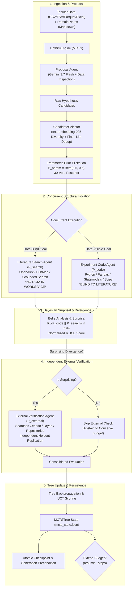

# Urithiru

Autonomous scientific discovery over your own tabular data. You supply CSV, TSV,
Parquet or Excel files and optional text notes. Agents perform exploratory analysis,
propose falsifiable hypotheses, form a literature-only prior, test each hypothesis
with code they write and execute, optionally seek independent external evidence, and
return a ranked report of what survived.

Beliefs reported by the system are **elicited model assessments, not calibrated
statistical confidence**.

## How it works

A run is a Monte Carlo tree search over hypotheses. Each **step** can use four agent
stages on one claim:

1. **Proposal** — an agent explores your files and proposes candidate claims.
   Duplicates are removed and the most novel candidate is selected.
2. **Search** and **Code**, at the same time, in separate workspaces and private homes. The search
   agent judges the claim from published literature; its workspace never receives your
   data. The code agent writes and runs an analysis against your data; it is never told
   what the literature concluded.
3. **External** — when those two answers disagree enough to be surprising, a fourth
   agent goes looking for independent data elsewhere and tests the claim again.

The result updates the tree, and the next step explores from there. `--steps` is how
many hypotheses you want evaluated.

The distance between the search and code beliefs is the whole point, so the two are
produced by agents that cannot see each other's work. Data-blindness is not a rule the
literature agent is asked to follow — the files are simply absent from its workspace.

Full detail: [docs/design.md](docs/design.md), [docs/architecture.md](docs/architecture.md).

## Architecture & Scientific Workflow



## Step-by-Step Setup

### Prerequisites
- **Python 3.12+** and [**uv**](https://docs.astral.sh/uv/)
- [**Bun**](https://bun.sh/) (for the web application)
- **Docker** (for local runs) or **Google Cloud SDK (`gcloud`)** (for Cloud Run Jobs)

### 1. Installation

```sh
# Clone repository
git clone https://github.com/eamag/urithiru.git
cd urithiru

# Install Python package and development tools
uv sync

# Install Web dashboard dependencies
cd web && bun install && cd ..

# Verify CLI
uv run urithiru --help
```

### 2. Get a dataset

Bring your own files, or build the demo bundle. This downloads the U.S. National Health
and Nutrition Examination Survey for August 2021 - August 2023 straight from the CDC:
eight linked tables covering 11,933 participants, plus the official codebook. Public
domain, about 4 MiB.

```sh
uv run python scripts/prepare_nhanes_demo.py --output ./data/nhanes
ls ./data/nhanes
```

`scripts/prepare_tsb_demo.py` builds a second, unrelated bundle from Canadian aviation
occurrence records, if you want to watch the same engine work on a different domain.

### 3. Run Locally (Docker)

The local runtime uses a Docker container holding your agent CLI and executes analyses in isolated workspaces.

```sh
# Export Google AI / Vertex credentials
export PROJECT_ID=your-project-id
export VERTEX_API_KEY=your-vertex-api-key

# Launch discovery over every file in the bundle
uv run urithiru run \
  --data ./data/nhanes/demographics.csv \
  --data ./data/nhanes/body_measures.csv \
  --data ./data/nhanes/blood_pressure.csv \
  --data ./data/nhanes/glycohemoglobin.csv \
  --data ./data/nhanes/hdl_cholesterol.csv \
  --data ./data/nhanes/sleep.csv \
  --data ./data/nhanes/physical_activity.csv \
  --data ./data/nhanes/depression_phq9.csv \
  --data ./data/nhanes/data_dictionary.csv \
  --metadata ./data/nhanes/metadata.md \
  --steps 3 \
  --seed 42
```

Follow the run live:
```sh
uv run urithiru logs ./runs/<run-id> --follow
uv run urithiru status ./runs/<run-id>
```

### 4. Run on Google Cloud (Cloud Run Jobs & Cloud Storage)

The cloud runtime uses **Google Cloud Run Jobs** for serverless orchestrator execution, **Cloud Storage** for atomic state checkpoints, and the **Antigravity CLI** + **Google GenAI SDK** for agent reasoning.

1. Copy the profile and fill in your own identifiers. `configs/google.toml` ships with
   placeholders and is refused until they are replaced; `*.local.toml` is gitignored, so
   your project and bucket never reach a commit. See [docs/google.md](docs/google.md) for
   the bucket, service account and job setup.

   ```sh
   cp configs/google.toml configs/google.local.toml
   $EDITOR configs/google.local.toml   # set project, region, bucket, orchestrator_job
   ```

2. Start a background discovery job:

```sh
uv run urithiru run \
  --config configs/google.local.toml \
  --data ./data/nhanes/demographics.csv \
  --data ./data/nhanes/body_measures.csv \
  --data ./data/nhanes/blood_pressure.csv \
  --data ./data/nhanes/glycohemoglobin.csv \
  --data ./data/nhanes/hdl_cholesterol.csv \
  --data ./data/nhanes/sleep.csv \
  --data ./data/nhanes/physical_activity.csv \
  --data ./data/nhanes/depression_phq9.csv \
  --data ./data/nhanes/data_dictionary.csv \
  --metadata ./data/nhanes/metadata.md \
  --steps 5 \
  --seed 42
```

3. Manage your cloud discovery:

```sh
uv run urithiru status gs://your-bucket/urithiru/<run-id>
uv run urithiru logs gs://your-bucket/urithiru/<run-id> --follow
uv run urithiru resume gs://your-bucket/urithiru/<run-id> --steps 8
uv run urithiru export gs://your-bucket/urithiru/<run-id> --output ./export
```

### 5. Interactive Web Dashboard

`web/` is an **Astro SSR web application** powered by **Svelte 5** and the **Node adapter** (`@astrojs/node`). It renders live MCTS search trees, 4-hop Bayesian belief progressions, the experiment agent's generated statistical charts and residual plots, and exports discovery reports (`report.md` / `report.json`).

```sh
# Start background publisher to mirror run state to web visualizer
uv run urithiru publish gs://your-bucket/urithiru/<run-id> --watch

# Start the web server (development mode)
cd web && bun run dev

# Or build and serve the production output
cd web && bun run build && node ./dist/server/entry.mjs
```

Open `http://localhost:4321` in your browser. Launching new runs through the UI is guarded by `URITHIRU_LAUNCH_TOKEN` (public deployments operate in secure read-only mode by default).

## Steps and time

`--steps` sets how many hypotheses to evaluate. The `[budget]` section of the profile
sets how long each stage may take, in minutes:

```toml
[budget]
proposal_minutes = 5
search_minutes = 8      # these two run at the same time,
code_minutes = 10       # so a step costs the larger of them, not the sum
external_minutes = 10
grace_minutes = 4
```

Override any of them for one run without editing the profile:

```sh
uv run urithiru run --data ./data.csv --steps 5 --external-minutes 25
```

A step costs at most `proposal + max(search, code) + external` minutes, and steps run
`parallelism` at a time (2 by default), so 5 steps with the values above is roughly
35-65 minutes of wall clock. Not every step reaches the external stage: it runs only
when the two beliefs disagreed enough. Because search and code run together, a step
holds up to two sandboxes at once, and a run holds up to `2 x parallelism`.

## Output

A run directory (local or in the bucket) holds:

```text
run_config.json         resolved settings, input hashes and metadata
mcts_state.json         authoritative tree, RNG, pending/completed IDs and status
events.jsonl            every event in order; read this to follow a run in progress
candidate_audits.json   raw proposals, duplicate decisions and selection evidence
inputs/                 your original files, unmodified
evaluations/            one immutable JSON per completed hypothesis
sandbox_artifacts/      each agent's code, execution logs and retained sources
```

`urithiru export` copies all of that to a new directory and adds `report.json` and
`report.md`, ranked by reward. Treat the evidence directory as private until you
have reviewed it.

## Commands

```text
urithiru run      --data FILE...        start a run
urithiru status   RUN                   progress, last update, and whether it is alive
urithiru logs     RUN [--follow]        the run's event log, in order
urithiru resume   RUN                   continue from the checkpoint
urithiru cancel   RUN                   stop, preserving completed work
urithiru publish  RUN [--watch]         copy the run where the web page can read it
urithiru export   RUN --output DIR      copy the run and write the ranked report
```

`RUN` is a local run directory or the `gs://bucket/prefix/run-id` printed at start;
every command works on both. The entry point is `app()` in
[src/urithiru/cli.py](src/urithiru/cli.py), where each command is one function whose
signature is its argument list and defaults.

## Verification and Tests

A test suite covers the load-bearing engineering and scientific components:

- **Belief arithmetic & posterior** (`tests/test_beliefs.py`): 30-vote pseudocounts, Beta(0.5, 0.5) smoothing, KL divergence in nats, and surprisal/reward calculations.
- **Candidate selection** (`tests/test_candidates.py`): Exact and semantic deduplication, cosine similarity diversity ranking, and retrieval caching.
- **Tree search & UCT** (`tests/test_tree.py`): Progressive widening, backpropagation, and state restoration.
- **State persistence & budget guard** (`tests/test_checkpoints.py`): Checkpoint round-trip serialization, seed matching, and monotonically growing budget guards.
- **Filesystem security** (`tests/test_files.py`): Path traversal rejection via `safe_path`, regular file validation, and atomic writes.
- **Config validation** (`tests/test_config.py`): Rejection of placeholders, non-positive budgets, and out-of-range parameters.
- **Runtime sandboxes** (`tests/test_sandbox.py`): Pure argument construction for Docker and Cloud Run launchers.
- **Publishing redaction** (`tests/test_publish.py`): Verifying that no published byte names the project or bucket, that the event log keeps every line and field except the run reference, and that removing a published run cannot escape the directory it is given.
- **Structural isolation** (`tests/test_isolation.py`): Verifying `DATA_STAGES` excludes literature search from accessing data files, verifying per-goal workspace and `HOME` separation, and verifying strict `trustedWorkspaces` scoping.
- **Web client & security guard** (`web/tests/`): Client-side belief calculations matching the Python posterior arithmetic, verdict determinations, stage chain formatting, run dataset grouping, and bearer token guard/rate-limiting.

Run the test suite and quality checks:

```sh
uv run pytest
uv run ruff check && uv run ruff format --check
uv run pyright
cd web && bun test && bun run check
```

## Provenance

The scientific engine — the MCTS search, belief analysis and prompt contracts —
**pre-exists this application work** and is ported here, as recorded in
[docs/provenance.md](docs/provenance.md). The standalone package, both runtimes,
the CLI and the cloud deployment are the new work.

