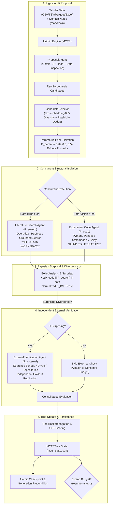
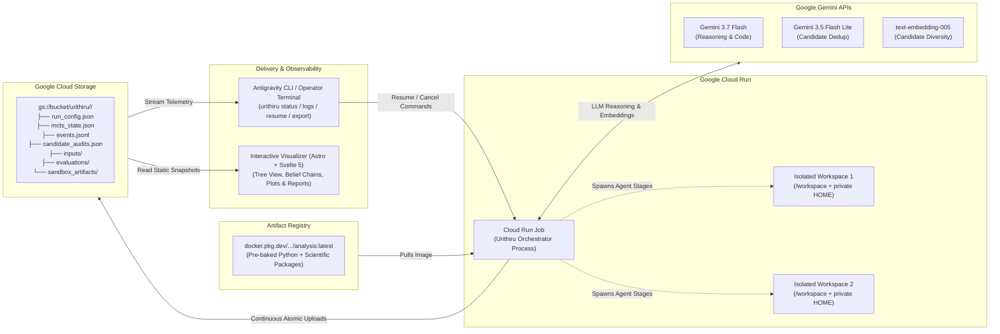

# Architecture

A run is a Monte Carlo tree search over hypotheses. Each step can use four agent stages
on one claim.

## System Overview & Scientific Workflow



## Cloud Infrastructure & Data Flow



## Why search and code are separate

A belief formed from the literature is only worth measuring against a belief formed
from the data if the two were formed independently. Earlier, one agent did both in
sequence: it wrote `p_search.json`, then opened the dataset, and the harness checked
after the fact that no `.py` file predated that write. Two problems. The check was
filesystem forensics over modification times, and the two beliefs came from the same
agent in the same context window, so their distance partly measured one agent's
self-consistency rather than a disagreement between sources.

Now they are two agent processes started at the same moment, with separate workspaces
and private homes in every runtime:

- the **search** agent's workspace contains `goal.txt` and nothing else — the dataset
  is never copied in, so data-blindness is a property of the filesystem rather than a
  promise in a prompt;
- the **code** agent is never told what the literature concluded, so it cannot anchor
  on it;
- each agent gets its own `HOME`, because the agent CLI keeps a scratch directory
  inside it. One home shared across a run's four stages hands every agent the previous
  agent's working files, which is a second route to the data that copying no dataset
  into the workspace does not close.

`KL(P_code || P_search)` is therefore a disagreement between two sources that could
not see each other, and the stage costs `max(search, code)` minutes instead of their
sum. `core/models.py` names the stages that receive data in `DATA_STAGES`; that tuple
is the whole enforcement mechanism.

### The isolation guarantee as a testable claim

The system enforces a strict four-layer structural isolation guarantee, verified by `tests/test_isolation.py`:

1. **Data-blind literature search**: The literature agent never sees the dataset because `DATA_STAGES = ("proposal", "code")` strictly excludes `search` and `external`. When a search goal runs, no dataset files are copied into the workspace. Data-blindness is physical and filesystem-level rather than a prompt suggestion or post-hoc timestamp audit.
2. **Dedicated workspaces per goal**: Every single goal executes in its own isolated directory (`sandbox_artifacts/<goal-id>`), preventing concurrent or sequential stages from reading sibling workspaces.
3. **Dedicated private `HOME` per goal**: Each goal receives a unique, dedicated `HOME` directory outside the run artifacts (`homes/<goal-id>`). Because the agent CLI maintains scratch and session state in `HOME`, isolated home roots prevent scratch-file leakage across stages and ensure retries start completely clean.
4. **Constrained trust boundary**: The agent configuration explicitly sets `trustedWorkspaces` to include only `/workspace` and the single goal's resolved workspace path (`agent_settings(workspace)`). It never trusts the parent directory containing other goals' workspaces, preventing cross-stage file reading even on the container fallback execution path.

## Checkpoints and outputs

```text
run_config.json             resolved settings, original input hashes and metadata
mcts_state.json             authoritative tree, RNG, pending/completed IDs and status
events.jsonl                every event in order; what to read to follow a live run
candidate_audits.json       raw proposals, duplicate decisions and selection evidence
inputs/                     original datasets
artifacts/                  embedding and merge caches
evaluations/                completed evaluations, reusable after interruption
sandbox_artifacts/          analysis code, source captures and execution logs
```

`mcts_state.json` says where a run got to; `events.jsonl` says what it did on the way.
Both live at the run prefix in the bucket, so any external reader can follow a run
without touching Cloud Logging. They are written on different schedules: the checkpoint
is uploaded under a generation precondition whenever the tree changes, while the event
log is mirrored as each line is written. A stage takes minutes, so a log that only moved
at checkpoints would leave a reader watching nothing for most of a step.

### What an agent leaves behind

`sandbox_artifacts/<goal-id>/` is the agent's own working directory. Docker and the
Preview gVisor path bind-mount it as `/workspace`; the verified Cloud Run fallback uses
the resolved path directly. Nothing prescribes what goes in it. The agent decides how
many scripts to write and how many experiments to run, and the retained tree is uploaded:

```text
sandbox_artifacts/code_node_000001/
    goal.txt                      what we asked
    agent.log                     the agent's own stdout and stderr
    explore_columns.py            whatever it decided to write, at any depth
    fit_baseline.py
    check_autocorrelation.py
    sensitivity_leave_one_site_out.py
    figures/residuals.png
    intermediate/cleaned.parquet
    result.json                   the one file the harness insists on
```

The agent's interpreter is `/opt/analysis`, a scientific Python built into the image
from `deploy/analysis-requirements.txt` and put on PATH at launch. It has pandas, numpy,
scipy, statsmodels, scikit-learn, pyarrow, the spreadsheet readers, matplotlib and the
HTTP/PDF/HTML parsers, so an agent starts working instead of installing.

`upload_directory` sends every regular file under the workspace and excludes exactly
three things: dot-directories (the agent's own session cache), symlinks, and the
`inputs/` copy of the seed data, which already lives once at the run prefix. There is
no file count limit and no naming convention — `result.json` is the only path the
harness reads, and it exists so the run has a machine-readable verdict, not to stand
in for the work.

Note that Cloud Run's filesystem is in memory and counts against the job's memory
limit, shared by every concurrent agent. A `code` agent writing large intermediates or
an `external` agent downloading a big independent dataset is bounded by that, not by
disk.

Every wall-clock and size limit lives in the profile's `[budget]` section, stated in
minutes and MiB, one `<stage>_minutes` per stage; there are no timeout constants
elsewhere.

One agent CLI, two runtime boundaries. Local goals run in Docker containers. Cloud Run
goals always get separate workspaces and private `HOME` directories. Cloud Run's Preview
gVisor sandbox launcher (`/usr/local/gcp/bin/sandbox`) is unavailable in current standard
environments (and cannot obtain Application Default Credentials when metadata access is
withheld). The runtime plainly discloses this: when the launcher is absent, the orchestrator
falls back to in-container isolation, emitting an explicit `sandbox_unavailable` warning
event with `isolation="container"`. Generated code runs directly in the container, bounded
by the job's tightly scoped service account (Storage object user and Vertex user only).

## The page

`web/` is a static page with no server behind it. `urithiru publish` copies
`mcts_state.json`, `events.jsonl` and a trimmed `run.json` out of a run — local or in a
bucket — into `web/public/runs/<id>/`, and `--watch` keeps copying until the run
finishes, so the page follows a live run without holding cloud credentials itself.

It renders those files as written rather than a shape assembled for it: the tree comes
from the checkpoint's nodes, each hypothesis's four probabilities are recomputed in the
browser from the same category counts the engine stored, and the log is the event file
line for line. `run.json` is the one exception, and it exists to take something away —
the run profile names the project, bucket and service account, and publishing a run
should not publish where it ran.

## Package layout

```text
cli.py            the entry point: one Typer function per command, defaults in the signature
core/             the science: MCTS, belief analysis, the loop. No network, no containers.
  models.py       every record, validating itself on construction
  beliefs.py      the three KLs one evaluation produces, and what they are worth
  tree.py         UCT selection, progressive widening, backpropagation
  candidates.py   dedupe, novelty and evidence retrieval over one embedding space
  engine.py       the loop
  report.py       ranking and export
agents/           what we ask a model to do, and how we read its answer back
  goals.py        builds each stage's goal; reads its result back into a record
  llm.py          prior, deduplication and embedding calls (Google GenAI SDK)
  prompts/        one text file per stage, each carrying its own literal contract
runtime/          how and where a run executes
  runs.py         LocalRun and CloudRun: what every CLI command actually calls
  config.py       the profile, and every limit in it
  files.py        path safety, hashing, atomic JSON, staged inputs
  sandbox.py      Sandbox base, DockerSandbox and CloudSandbox side by side
  control.py events.py
cloud/            the Google transport
  client.py       Cloud Storage transfers and Cloud Run job control
```

`core/` imports nothing from `cloud/`, and `runtime/sandbox.py` reaches Google only
through `GoogleCloud`'s public methods, so the science stays testable without a
network. Both sandboxes are the same shape: `Sandbox` owns the workspace lifecycle
and each subclass supplies only `launch`.

One local process owns a run directory. Successful sibling results are written
before ordered tree updates, so a sibling failure does not discard completed work.
The engine reloads the tree, pending nodes and RNG from its checkpoint. Google
uploads and downloads these same files; it does not use a separate state model.

## Scientific details

The five-category representation, 30 pseudovotes and Beta(0.5, 0.5) conversion match
the research calculation. Seed reward is `tanh(KL(P_code || P_search))`; external
reward retains the information-minus-cost calculation.

One evaluation reports six numbers, one per question, all in nats over the same five
categories so they are directly comparable:

| | |
| --- | --- |
| `kl_search_param` | what the literature search added to the naked model prior |
| `kl_code_search` | what running the experiment added to the literature — this drives reward |
| `kl_code_param` | what the evaluation added in total |
| `r_ice_norm` | the share of that information which came from data rather than literature |
| `belief_change` | the same move as a readable probability delta |
| `is_surprising` | whether that was enough to spend an agent turn looking for independent data |

EDA is descriptive only: it must not test candidate claims or put fitted statistics in
hypotheses. The four execution/specification/direction/support flags stay separate.
Negative evidence is retained; terminal nodes are excluded from retrieval. External
evidence must preserve the literal claim and independent population, with abstention
allowed and unrewarded.

## Trust boundary

This is for a trusted operator running their own deployment. Docker mounts the agent
login volume and one workspace, never the research `.env` or the Docker socket. Google
workers have dedicated service identities. Under `sandbox do` generated Python reaches
neither the job's environment nor the metadata server; without it, that identity is
reachable and the blast radius is exactly the service account's own permissions — the
run bucket and Vertex predict. Neither mode is a hostile-tenant sandbox.

Docker goals receive only the operator's agent-login volume and their workspace. The
verified Cloud Run fallback uses ADC from the job identity, so generated code can reach
exactly the services that identity can; it is not correct to describe that process as
credential-free. Symlinks and stray `.env` files are removed from retained workspaces,
but review artifacts before sharing them. Independence of a *downloaded* dataset is not
something the harness can prove; retain and inspect its provenance.
