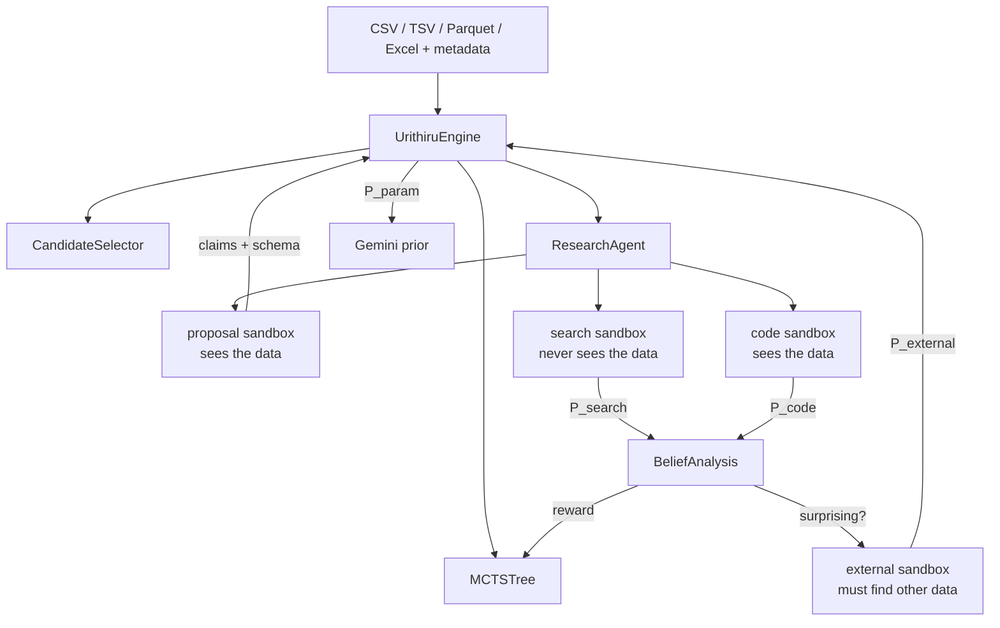

# Architecture

A run is a Monte Carlo tree search over hypotheses. Each step spends four agent
containers on one claim.



## Why search and code are separate containers

A belief formed from the literature is only worth measuring against a belief formed
from the data if the two were formed independently. Earlier, one agent did both in
sequence: it wrote `p_search.json`, then opened the dataset, and the harness checked
after the fact that no `.py` file predated that write. Two problems. The check was
filesystem forensics over modification times, and the two beliefs came from the same
agent in the same context window, so their distance partly measured one agent's
self-consistency rather than a disagreement between sources.

Now they are two sandboxes started at the same moment:

- the **search** agent's workspace contains `goal.txt` and nothing else — the dataset
  is never copied in, so data-blindness is a property of the filesystem rather than a
  promise in a prompt;
- the **code** agent is never told what the literature concluded, so it cannot anchor
  on it.

`KL(P_code || P_search)` is therefore a disagreement between two sources that could
not see each other, and the stage costs `max(search, code)` minutes instead of their
sum. `core/models.py` names the stages that receive data in `DATA_STAGES`; that tuple
is the whole enforcement mechanism.

## Checkpoints and outputs

```text
run_config.json             resolved settings, original input hashes and metadata
mcts_state.json             authoritative tree, RNG, pending/completed IDs and status
events.jsonl                every event in order; what to read to follow a live run
candidate_audits.json       raw proposals, duplicate decisions and selection evidence
inputs/                     original datasets
artifacts/                  embedding and merge caches
evaluations/                completed evaluations, reusable after interruption
sandbox_artifacts/          analysis code, source captures and execution logs
```

`mcts_state.json` says where a run got to; `events.jsonl` says what it did on the way.
Both are checkpointed together, so in the cloud both live at the run prefix in the
bucket and any external reader can follow a run without touching Cloud Logging.

Every wall-clock and size limit lives in the profile's `[budget]` section, stated in
minutes and MiB, one `<stage>_minutes` per stage; there are no timeout constants
elsewhere.

One agent CLI, two isolations. Both runtimes launch the same binary over the same
workspace; locally inside a Docker container, and in Cloud Run inside a `sandbox do`
process that withholds the job's environment and the metadata server, so generated
code cannot reach the run's service identity. Cloud Run sandboxes are a Preview
feature: when the binary is absent the agent runs directly in the job container,
which logs `sandbox_unavailable` and drops to the weaker boundary below.

## Package layout

```text
cli.py            the entry point: one Typer function per command, defaults in the signature
core/             the science: MCTS, belief analysis, the loop. No network, no containers.
  models.py       every record, validating itself on construction
  beliefs.py      the three KLs one evaluation produces, and what they are worth
  tree.py         UCT selection, progressive widening, backpropagation
  candidates.py   dedupe, novelty and evidence retrieval over one embedding space
  engine.py       the loop
  report.py       ranking and export
agents/           what we ask a model to do, and how we read its answer back
  goals.py        builds each stage's goal; reads its result back into a record
  llm.py          prior, deduplication and embedding calls (Google GenAI SDK)
  prompts/        one text file per stage, each carrying its own literal contract
runtime/          how and where a run executes
  runs.py         LocalRun and CloudRun: what every CLI command actually calls
  config.py       the profile, and every limit in it
  files.py        path safety, hashing, atomic JSON, staged inputs
  sandbox.py      Sandbox base, DockerSandbox and CloudSandbox side by side
  control.py events.py
cloud/            the Google transport
  client.py       Cloud Storage transfers and Cloud Run job control
```

`core/` imports nothing from `cloud/`, and `runtime/sandbox.py` reaches Google only
through `GoogleCloud`'s public methods, so the science stays testable without a
network. Both sandboxes are the same shape: `Sandbox` owns the workspace lifecycle
and each subclass supplies only `launch`.

One local process owns a run directory. Successful sibling results are written
before ordered tree updates, so a sibling failure does not discard completed work.
The engine reloads the tree, pending nodes and RNG from its checkpoint. Google
uploads and downloads these same files; it does not use a separate state model.

## Scientific details

The five-category representation, 30 pseudovotes and Beta(0.5, 0.5) conversion match
the research calculation. Seed reward is `tanh(KL(P_code || P_search))`; external
reward retains the information-minus-cost calculation.

One evaluation reports six numbers, one per question, all in nats over the same five
categories so they are directly comparable:

| | |
| --- | --- |
| `kl_search_param` | what the literature search added to the naked model prior |
| `kl_code_search` | what running the experiment added to the literature — this drives reward |
| `kl_code_param` | what the evaluation added in total |
| `r_ice_norm` | the share of that information which came from data rather than literature |
| `belief_change` | the same move as a readable probability delta |
| `is_surprising` | whether that was enough to spend a container looking for independent data |

EDA is descriptive only: it must not test candidate claims or put fitted statistics in
hypotheses. The four execution/specification/direction/support flags stay separate.
Negative evidence is retained; terminal nodes are excluded from retrieval. External
evidence must preserve the literal claim and independent population, with abstention
allowed and unrewarded.

## Trust boundary

This is for a trusted operator running their own deployment. Docker mounts the agent
login volume and one workspace, never the research `.env` or the Docker socket. Google
workers have dedicated service identities. Under `sandbox do` generated Python reaches
neither the job's environment nor the metadata server; without it, that identity is
reachable and the blast radius is exactly the service account's own permissions — the
run bucket and Vertex predict. Neither mode is a hostile-tenant sandbox.

No sandbox is given API credentials beyond the agent's own model key, so generated
code has outbound network and nothing to leak. Symlinks and stray `.env` files are
removed from a workspace after each container exits, but review artifacts before
sharing them. Independence of a *downloaded* dataset is not something the harness can
prove; retain and inspect its provenance.
