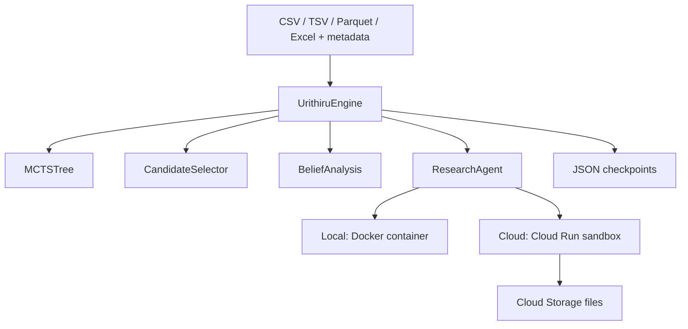

# Architecture



The Python modules mirror these responsibilities. [original-logic.md](original-logic.md) maps the
original methods and scientific constraints to the standalone version.

## Checkpoints and outputs

```text
run_config.json             resolved settings, original input hashes and metadata
mcts_state.json             authoritative tree, RNG, pending/completed IDs and status
candidate_audits.json       raw proposals, duplicate decisions and selection evidence
inputs/                    original datasets
artifacts/                 embedding and merge caches
evaluations/               completed evaluations, reusable after interruption
sandbox_artifacts/         analysis code, source captures and execution logs
```

Every wall-clock and size limit lives in the profile's `[budget]` section, stated in
minutes and MiB and resolved into one `Budget` at config load; there are no timeout
constants elsewhere.

One agent, two isolations. Both runtimes launch the same agent CLI over the same
workspace; locally that happens inside a Docker container, and in Cloud Run inside a
`sandbox do` process that withholds the job's environment and the metadata server, so
generated code cannot reach the run's service identity.

Phase A ordering is enforced by the prompt and then *checked from the artifacts*:
`read_verification` rejects a workspace whose analysis scripts predate `p_search.json`.

## Package layout

```text
cli.py            the entry point: one Typer function per command, defaults in the signature
core/             the science: MCTS, belief analysis, the loop. No network, no containers.
  models.py beliefs.py tree.py deduplication.py engine.py report.py
agents/           what we ask a model to do, and how we read its answer back
  goals.py        builds the proposal/verification/external goals; reads their results
  llm.py          prior, deduplication and embedding calls (Google GenAI SDK)
  prompts/        one text file per stage, each carrying its own literal contract
runtime/          how and where a run executes
  runs.py         LocalRun and CloudRun: what every CLI command actually calls
  config.py files.py checkpoints.py control.py events.py
  sandbox.py      Sandbox base, DockerSandbox and CloudSandbox side by side
cloud/            the Google transport
  client.py       Cloud Storage transfers and Cloud Run job control
```

`core/` imports nothing from `cloud/`, and `runtime/sandbox.py` reaches Google only
through `GoogleCloud`'s public methods, so the science stays testable without a
network. Both sandboxes are the same shape: `Sandbox` owns the workspace lifecycle
and each subclass supplies only `execute`.

One local process owns a run directory. Successful sibling results are written
before ordered tree updates, so a sibling failure does not discard completed work.
The engine reloads the tree, pending nodes and RNG from its checkpoint. Google
uploads/downloads these same files; it does not use a separate state model.

## Scientific details

The five-category representation, 30 pseudovotes and Beta(0.5, 0.5) conversion match
the active research calculation. Seed reward is `tanh(KL(P_code || P_search))`;
external reward retains the original information-minus-cost calculation. R_ICE,
log/normalized R_ICE, fidelity, incompatibility measures and EFE remain diagnostics.

EDA is descriptive only: it must not test candidate claims or put fitted statistics
in hypotheses. Literature assessment precedes seed observation access. The four
execution/specification/direction/support flags stay separate. Negative evidence
is retained; terminal nodes are excluded from retrieval. External evidence must
preserve the literal claim and independent population, with abstention allowed.

## Trust boundary

This is for a trusted operator running their own deployment. Docker mounts the
AGY login volume and one workspace, never the research `.env` or Docker socket.
Google workers have dedicated service identities. Generated Python can access the
worker's identity through the metadata server; this is not a hostile-tenant sandbox.

Known declared local credentials are redacted from generated files, but review
artifacts before sharing. AGY's Phase A ordering is prompt-enforced. Google's tools
gate data access until `p_search.json` is saved. Neither mechanism proves the
scientific independence of a downloaded dataset; retain and inspect its provenance.

