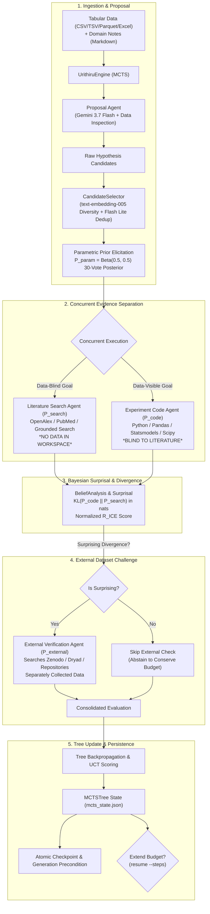
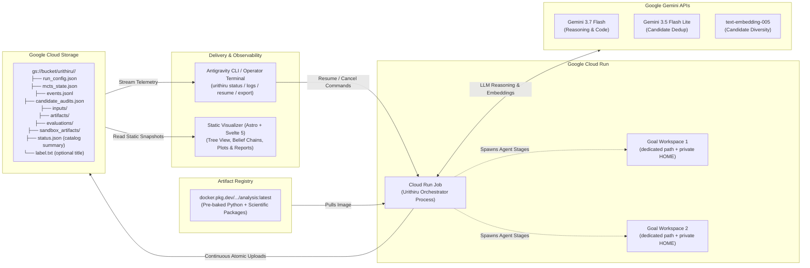

# Architecture

A run is a Monte Carlo tree search over hypotheses. Each step can use four agent stages
on one claim.

## System Overview & Scientific Workflow



## Cloud Infrastructure & Data Flow



## Checkpoints and outputs

```text
run_config.json             resolved settings, original input hashes and metadata
mcts_state.json             authoritative tree, RNG, pending/completed IDs and status
events.jsonl                every event in order; what to read to follow a live run
candidate_audits.json       raw proposals, duplicate decisions and selection evidence
inputs/                     original datasets
artifacts/                  embedding and merge caches (embeddings.json, dedupe_llm_decisions.json)
evaluations/                completed evaluations, reusable after interruption
sandbox_artifacts/          analysis code, source captures and execution logs
status.json                 lightweight progress summary for fast bucket catalog listing
label.txt                   optional human-readable title attached by operator
```

`mcts_state.json` says where a run got to; `events.jsonl` says what it did on the way.
Both live at the run prefix in the bucket, so any external reader can follow a run
without touching Cloud Logging. `status.json` allows the catalog and static index builder to list
bucket runs in $O(1)$ without downloading megabyte checkpoint trees. They are written
on different schedules: the checkpoint is uploaded under a generation precondition
whenever the tree changes, while the event log is mirrored as each line is written. A stage takes minutes, so a log that only moved
at checkpoints would leave a reader watching nothing for most of a step.

### What an agent leaves behind

`sandbox_artifacts/<goal-id>/` is the agent's own working directory. Docker
bind-mounts it at `/workspace`. On Cloud Run it is bind-mounted at `/workspace`
when the sandbox binary is present; otherwise the agent runs in place at the
resolved path with container-level isolation and a `sandbox_unavailable` warning
is emitted. Nothing prescribes what goes in it. The agent decides how
many scripts to write and how many experiments to run, and the retained tree is uploaded:

```text
sandbox_artifacts/code_node_000001/
    goal.txt                      what we asked
    agent.log                     the agent's own stdout and stderr
    explore_columns.py            whatever it decided to write, at any depth
    fit_baseline.py
    check_autocorrelation.py
    sensitivity_leave_one_site_out.py
    figures/residuals.png
    intermediate/cleaned.parquet
    result.json                   the one file the harness insists on
```

The agent's interpreter is `/opt/analysis`, a scientific Python built into the image
from `deploy/analysis-requirements.txt` and put on PATH at launch. It has pandas, numpy,
scipy, statsmodels, scikit-learn, pyarrow, the spreadsheet readers, matplotlib and the
HTTP/PDF/HTML parsers, so an agent starts working instead of installing.

`upload_directory` sends every regular file under the workspace and excludes exactly
three things: dot-directories (the agent's own session cache), symlinks, and the
`inputs/` copy of the seed data, which already lives once at the run prefix. Docker
cleanup additionally removes symlinks and any `.env` file from the retained workspace,
and the cloud upload skips dot-files for the same reason, so agent credentials never
persist in run artifacts. There is
no file count limit and no naming convention — `result.json` is the only path the
harness reads, and it exists so the run has a machine-readable verdict, not to stand
in for the work.

Note that Cloud Run's filesystem is in memory and counts against the job's memory
limit, shared by every concurrent agent. A `code` agent writing large intermediates or
an `external` agent downloading a large candidate dataset is bounded by that, not by
disk.

Every wall-clock and size limit lives in the profile's `[budget]` section, stated in
minutes and MiB, one `<stage>_minutes` per stage; there are no timeout constants
elsewhere.

## The page

`web/` is a static Astro site with a public explainer at `/` and the run workspace
at `/workspace`. `urithiru publish` copies `mcts_state.json`, `events.jsonl` and
a trimmed `run.json` out of a run — local or in a bucket — into
`web/public/runs/<id>/` before the site is built. The browser reads only those static,
sanitized files and never receives cloud credentials. Runs are launched, resumed and
cancelled through the CLI, not the web page.

It renders those files as written rather than a shape assembled for it: the tree comes
from the checkpoint's nodes, each hypothesis's four probabilities are recomputed in the
browser from the same category counts the engine stored, and the log is the event file
line for line. `run.json` is the one exception, and it exists to take something away —
the run profile names the project, bucket and service account, and publishing a run
should not publish where it ran.

## Scientific details

The five-category representation, 30 pseudovotes and Beta(0.5, 0.5) conversion match
the research calculation. Seed reward is `tanh(KL(P_code || P_search))`; external
reward retains the information-minus-cost calculation.

One evaluation reports six numbers, one per question, all in nats over the same five
categories so they are directly comparable:

| | |
| --- | --- |
| `kl_search_param` | what the literature search added to the naked model prior |
| `kl_code_search` | what running the experiment added to the literature — this drives reward |
| `kl_code_param` | what the evaluation added in total |
| `r_ice_norm` | the share of that information which came from data rather than literature |
| `belief_change` | the same move as a readable probability delta |
| `is_surprising` | whether that was enough to spend an agent turn looking for external data |

Negative evidence is retained; terminal nodes are excluded from retrieval. The external
agent is instructed to preserve the literal claim and use a non-overlapping population,
with abstention allowed and unrewarded. The host validates the returned structure but
does not independently verify that provenance, recompute the reported analysis or certify
the agent's validity flags. Those artifacts are retained so an operator can do that review.
