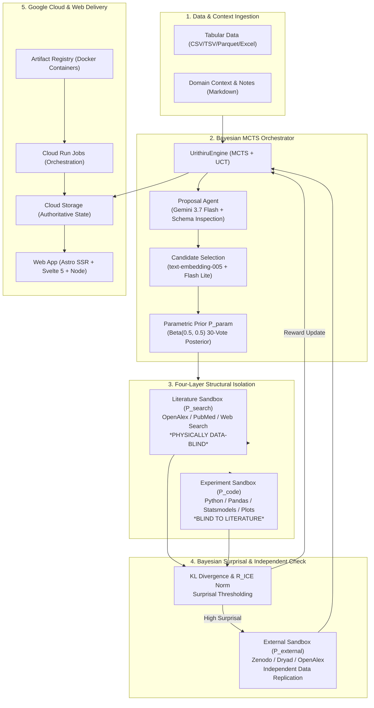

# Urithiru

**Tagline:** Autonomous Bayesian scientific discovery over your own tabular data — formulating hypotheses, eliciting data-blind literature priors, executing empirical code in isolated sandboxes, and verifying signals against independent repositories.

---

## Inspiration

Scientific progress is bottlenecked by the gap between hypothesis generation and rigorous empirical verification. While LLMs excel at drafting plausible hypotheses, they notoriously hallucinate literature support, overfit to sample noise, conflate prior beliefs with empirical evidence, and fail to independently replicate findings against held-out repositories.

In disciplines ranging from epidemiology (CDC NHANES) and paleoclimatology (speleothem geochemistry) to transport safety (aviation occurrence registries), scientists spend months harmonizing datasets, coding regression baselines, adjusting for confounders and multiplicity, and cross-referencing external databases.

**Urithiru** transforms this entire lifecycle into an autonomous, mathematically rigorous, and auditable Bayesian Monte Carlo Tree Search (MCTS) orchestrator.

---

## What It Does

Given any collection of tabular datasets (CSV, TSV, Parquet, or Excel) and optional domain metadata notes:

1. **Exploratory Proposal**: An agent inspects the dataset schema, data distributions, and domain notes to propose a diverse batch of falsifiable, mechanism-rich scientific hypotheses.
2. **Deduplication & Diversity Selection**: Prototypical claims undergo exact text canonicalization, LLM semantic equivalence checks (Gemini 3.5 Flash Lite), and embedding-based diversity ranking (`text-embedding-005`), filtering out redundant proposals.
3. **Parametric Prior Elicitation ($P_{\text{param}}$)**: A 30-vote pseudocount prior is elicited from Gemini 3.7 Flash using a Beta(0.5, 0.5) smoothed posterior.
4. **Concurrent, Isolated Literature & Empirical Testing**:
   - **Literature Agent ($P_{\text{search}}$)**: Searches OpenAlex, PubMed, and Google Search grounding to assess published domain consensus. *Crucially, its sandbox never receives your data.*
   - **Experiment Code Agent ($P_{\text{code}}$)**: Operates in a separate isolated container, writing and executing Python scripts (Pandas, SciPy, Statsmodels, Scikit-Learn, Matplotlib) directly against the data. *Crucially, it never sees the literature conclusion.*
5. **Bayesian Surprisal & Divergence Analysis**: The engine computes categorical Kullback-Leibler (KL) divergences in nats and normalized Information Change Efficiency ($R_{\text{ICE}}$):
   $$\text{KL}(P_{\text{code}} \parallel P_{\text{search}}), \quad \text{KL}(P_{\text{code}} \parallel P_{\text{param}}), \quad \text{KL}(P_{\text{search}} \parallel P_{\text{param}})$$
6. **Independent External Verification ($P_{\text{external}}$)**: When an empirical finding significantly contradicts the literature ($P_{\text{code}}$ vs $P_{\text{search}}$), a fourth agent searches external global repositories (Zenodo, Dryad, OpenAlex, national censuses) for independent holdout datasets and verifies the claim.
7. **Tree Search & Iterative Deepening**: Evaluated nodes update the MCTS tree via Upper Confidence Bounds for Trees (UCT) with progressive widening. Operators can seamlessly extend running or completed discoveries (`resume --steps`) without restarting from scratch.
8. **Ranked Discovery Reports & Multimodal UX**: Generates ranked synthesis reports (`report.md`, `report.json`) and renders interactive search trees, 4-hop belief chains ($P_{\text{param}} \to P_{\text{search}} \to P_{\text{code}} \to P_{\text{external}}$), and the experiment agent's own statistical charts and residual plots.

---

## Real Multi-Domain Discoveries

Urithiru was evaluated on diverse real-world scientific datasets:
- **CDC NHANES Biomedical Epidemiology**: Uncovering interactions between glycohemoglobin levels, systolic blood pressure, sleep duration, and depressive symptoms (PHQ-9) across thousands of patient records.
- **Paleoclimatology & Karst Hydrogeology**: Analyzing high-precision uranium-thorium disequilibrium ($\delta^{234}\text{U}$) and co-eval stalagmite isotopic coupling ($\delta^{18}\text{O}$, $\delta^{13}\text{C}$) over millennial timescales.
- **Transportation Safety (TSB Canada & U.S. NTSB)**: Evaluating multi-table flight phase occurrences, component failures, and cross-border safety pattern replication.

---

## Architecture & Technology Stack



- **Google AI Models**:
  - **Gemini 3.7 Flash**: High-precision reasoning for exploratory hypothesis proposal, Bayesian literature synthesis, experimental Python script synthesis, and external discovery.
  - **Gemini 3.5 Flash Lite**: Rapid semantic equivalence audits and candidate deduplication.
  - **`text-embedding-005`**: 768-dimensional embeddings for candidate diversity ranking and cosine similarity selection.
- **Autonomous Agent CLI**: Driven by the **Antigravity CLI** (`agy`) with isolated execution environments and strict tool capability scoping.
- **Compute & Storage Infrastructure**:
  - **Google Cloud Run Jobs**: Serverless, autoscaling orchestrator execution supporting up to 7-day extended research horizons.
  - **Google Cloud Storage**: Authoritative, atomic state store holding `mcts_state.json`, streaming `events.jsonl`, `candidate_audits.json`, and all `sandbox_artifacts/`.
  - **Google Artifact Registry**: Container image hosting.
- **Web UI & Visualizer**: Built with **Astro 7**, **Svelte 5**, and **Bun**, offering real-time streaming tree visualizations, 4-stage belief chains, interactive residual/distribution plots, operator token authentication, and instant report export.

---

## The Four-Layer Structural Isolation Guarantee

The entire premise of measuring belief divergence ($\text{KL}(P_{\text{code}} \parallel P_{\text{search}})$) relies on data-blindness being an absolute structural property rather than a prompt suggestion:

1. **Filesystem Data-Blindness**: `DATA_STAGES = ("proposal", "code")` strictly omits `search` and `external`. No dataset files exist in the literature workspace.
2. **Dedicated Workspace per Goal**: Every stage runs in a dedicated `sandbox_artifacts/<goal_id>` directory.
3. **Dedicated Private `HOME` per Goal**: The agent CLI keeps session state in `HOME`; assigning unique `homes/<goal_id>` per goal prevents scratch-file leakage across stages.
4. **Constrained Trust Boundaries**: `trustedWorkspaces` only whitelists `/workspace` and the single goal's folder, preventing cross-stage inspection.
5. **Plain Isolation Disclosure**: Where gVisor sandbox virtualization is unavailable, the orchestrator plainly discloses this by falling back to in-container isolation and emitting a `sandbox_unavailable` event.

---

## Testing & Engineering Discipline

Urithiru is backed by a comprehensive automated test suite (51 Python tests and 17 TypeScript tests) running across continuous integration:

- **Belief Arithmetic**: 30-vote pseudocount posterior derivation with Beta(0.5, 0.5) smoothing, categorical KL divergence in nats, and surprisal/reward calculations.
- **Candidate Selection**: Exact canonicalization, semantic duplicate elimination, cosine similarity diversity, and retrieval caching.
- **Tree & Checkpoints**: MCTS node UCT scoring, progressive widening bounds, atomic state serialization, monotonically growing budget guards, and root visit invariance.
- **Security & Filesystem**: Path traversal guards via `safe_path` (blocking `../`, absolute escaping paths, symlinks, and backslashes) and operator launch token rate limiting.
- **Runtimes & CLI**: Pure argument construction for Docker and Cloud Run Jobs.
- **Full CI Workflow**: GitHub Actions executing `pytest`, `ruff check`, `ruff format --check`, `pyright`, `bun test`, and `astro check`.

---

## What We Learned

1. **Agent Independence Requires Strict State Hygiene**: Prompts alone cannot guarantee that an agent won't anchor on previous conclusions. Isolating filesystem access, `HOME` environments, tool histories, and network boundaries is essential for unpolluted scientific inquiry.
2. **Negative Results are High-Value Discoveries**: A clean empirical refutation ($\text{empirical\_support} = \text{false}$) is not a failure; it provides valuable Bayesian information gain that prunes search branches and guides the tree toward true discoveries.
3. **Plain-File Architectures Ensure Total Auditability**: By storing authoritative run state in plain JSON and streaming JSONL events, every scientific decision, candidate audit, generated script, and metric is permanently auditable without hidden database states.

---

## Reproduction & Quick Start

```sh
# Clone & install dependencies
git clone https://github.com/eamag/urithiru.git
cd urithiru
uv sync

# Run the test suite across Python and Web
uv run pytest
cd web && bun test && bun run check && cd ..

# Launch a local discovery run with Docker
export PROJECT_ID=your-project VERTEX_API_KEY=your-key
uv run urithiru run --data ./data/measurements.csv --steps 3

# Launch on Google Cloud Run Jobs
uv run urithiru run --config configs/google.toml --data ./data/measurements.csv --steps 5

# Launch the interactive web visualizer
cd web && bun run dev
```
